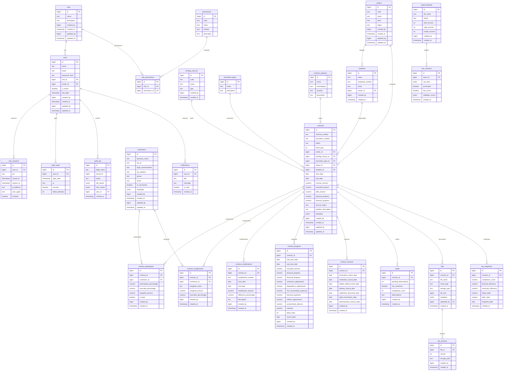

```mermaid
erDiagram

    %% =========================================
    %% USUARIOS, ROLES Y SEGURIDAD
    %% =========================================

    users {
        bigint id PK
        text name
        text email
        text password_hash
        bigint role_id FK
        bigint center_id FK
        boolean is_active
        timestamp last_login
        bigint created_by
        timestamp created_at
        bigint updated_by
        timestamp updated_at
    }

    roles {
        bigint id PK
        text name
        text description
        bigint created_by
        timestamp created_at
        bigint updated_by
        timestamp updated_at
    }

    permissions {
        bigint id PK
        text code
        text name
        text module
        text description
    }

    role_permissions {
        bigint id PK
        bigint role_id FK
        bigint permission_id FK
    }

    user_sessions {
        bigint id PK
        bigint user_id FK
        text jwt
        timestamp issued_at
        timestamp expires_at
        text ip_address
        text user_agent
        boolean revoked
    }

    login_audit {
        bigint id PK
        bigint user_id FK
        timestamp login_date
        text ip
        boolean success
        int failed_attempts
    }

    audit_log {
        bigint id PK
        text table_name
        bigint record_id
        text action
        jsonb old_values
        jsonb new_values
        bigint user_id FK
        timestamp created_at
    }

    %% =========================================
    %% CATÁLOGOS
    %% =========================================

    centers {
        bigint id PK
        text code
        text name
        text state
        text region
        bigint created_by
        timestamp created_at
        bigint updated_by
        timestamp updated_at
    }

    funding_sources {
        bigint id PK
        text code
        text name
        text type
        bigint created_by
        timestamp created_at
    }

    procedure_types {
        bigint id PK
        text name
        text description
    }

    contract_statuses {
        bigint id PK
        text name
        text subcategory
        text severity
        text description
    }

    %% =========================================
    %% CONTRATISTAS
    %% =========================================

    contractors {
        bigint id PK
        text business_name
        text tax_id
        text legal_representative
        text tax_address
        text phone
        text email
        boolean is_sanctioned
        jsonb metadata
        bigint created_by
        timestamp created_at
        bigint updated_by
        timestamp updated_at
    }

    %% =========================================
    %% RESIDENTES
    %% =========================================

    residents {
        bigint id PK
        text name
        text employee_number
        text email
        bigint center_id FK
        bigint created_by
        timestamp created_at
    }

    %% =========================================
    %% CONTRATOS
    %% =========================================

    contracts {
        bigint id PK
        text contract_number
        text procedure_number
        text object
        int fiscal_year

        bigint center_id FK
        bigint funding_source_id FK
        bigint procedure_type_id FK
        bigint status_id FK
        bigint resident_id FK

        date start_date
        date end_date

        numeric contract_amount
        numeric executed_amount
        numeric debt_amount

        numeric physical_progress
        numeric financial_progress

        text closure_status
        text problem_description

        jsonb metadata

        bigint created_by
        timestamp created_at
        bigint updated_by
        timestamp updated_at
    }

    %% =========================================
    %% PARTICIPACIÓN CONJUNTA
    %% =========================================

    contract_participants {
        bigint id PK
        bigint contract_id FK
        bigint contractor_id FK

        numeric participation_percentage
        numeric executed_percentage
        numeric assigned_amount

        boolean is_lead

        bigint created_by
        timestamp created_at
    }

    %% =========================================
    %% CESIÓN DE DERECHOS
    %% =========================================

    contract_assignments {
        bigint id PK
        bigint contract_id FK
        bigint contractor_id FK

        text assignee_name

        numeric assigned_amount
        numeric execution_percentage

        bigint created_by
        timestamp created_at
    }

    %% =========================================
    %% MODIFICACIONES / CONVENIOS
    %% =========================================

    contract_modifications {
        bigint id PK
        bigint contract_id FK

        text modification_number

        date start_date
        date end_date

        numeric modification_amount
        numeric difference_percentage

        text description

        bigint created_by
        timestamp created_at
    }

    %% =========================================
    %% AVANCES Y EJECUCIÓN
    %% =========================================

    contract_progress {
        bigint id PK
        bigint contract_id FK

        date real_start_date
        date real_end_date

        numeric executed_amount
        numeric physical_progress
        numeric financial_progress

        numeric contractor_adjustments
        numeric dependency_adjustments

        numeric non_recoverable_expenses
        numeric financial_expenses

        numeric indirect_adjustments
        numeric unamortized_advance
        numeric interests

        int delay_days

        date record_date

        bigint created_by
        timestamp created_at
    }

    %% =========================================
    %% CIERRES ADMINISTRATIVOS
    %% =========================================

    contract_closures {
        bigint id PK
        bigint contract_id FK

        date termination_notice_date
        date verification_record_date
        date hidden_defects_bond_date
        date delivery_record_date
        date settlement_document_date
        date rights_termination_date
        date administrative_closure_date

        bigint created_by
        timestamp created_at
    }

    %% =========================================
    %% AUDITORÍAS Y CUMPLIMIENTO
    %% =========================================

    audits {
        bigint id PK
        bigint contract_id FK

        int pending_observations

        boolean has_sanctions

        int compliance_score

        text observations

        bigint created_by
        timestamp created_at
    }

    %% =========================================
    %% ARCHIVOS Y DOCUMENTOS
    %% =========================================

    files {
        bigint id PK
        bigint contract_id FK

        text file_name
        text mime_type
        text storage_path

        bigint file_size

        jsonb metadata

        bigint uploaded_by FK
        timestamp created_at
    }

    file_versions {
        bigint id PK
        bigint file_id FK

        int version

        text storage_path

        bigint created_by
        timestamp created_at
    }

    %% =========================================
    %% IMPORTACIONES ETL
    %% =========================================

    import_batches {
        bigint id PK
        text file_name
        text status
        int total_records
        int valid_records
        int invalid_records
        bigint created_by
        timestamp created_at
    }

    raw_contracts {
        bigint id PK
        bigint batch_id FK

        jsonb raw_data

        boolean processed
        boolean has_errors

        jsonb validation_errors

        timestamp created_at
    }

    %% =========================================
    %% KPI Y ANALÍTICA
    %% =========================================

    kpi_snapshots {
        bigint id PK
        bigint contract_id FK

        numeric compliance_score
        numeric financial_efficiency
        numeric execution_efficiency
        numeric delay_index
        numeric debt_index

        date snapshot_date

        timestamp created_at
    }

    %% =========================================
    %% NOTIFICACIONES
    %% =========================================

    notifications {
        bigint id PK
        bigint user_id FK

        text title
        text message

        boolean is_read

        timestamp created_at
    }

    %% =========================================
    %% RELACIONES
    %% =========================================

    roles ||--o{ users : "has"
    users ||--o{ user_sessions : "sessions"
    users ||--o{ login_audit : "login"
    roles ||--o{ role_permissions : "permissions"
    permissions ||--o{ role_permissions : "assigned"

    users ||--o{ audit_log : "actions"

    centers ||--o{ residents : "belongs"
    centers ||--o{ contracts : "manages"

    funding_sources ||--o{ contracts : "funds"
    procedure_types ||--o{ contracts : "procedure"
    contract_statuses ||--o{ contracts : "status"

    residents ||--o{ contracts : "responsible"

    contracts ||--o{ contract_participants : "participants"
    contractors ||--o{ contract_participants : "participates"

    contracts ||--o{ contract_assignments : "assignments"
    contractors ||--o{ contract_assignments : "assigned"

    contracts ||--o{ contract_modifications : "modifications"

    contracts ||--o{ contract_progress : "progress"

    contracts ||--o{ contract_closures : "closures"

    contracts ||--o{ audits : "audits"

    contracts ||--o{ files : "documents"
    files ||--o{ file_versions : "versions"

    import_batches ||--o{ raw_contracts : "imports"

    contracts ||--o{ kpi_snapshots : "snapshots"

    users ||--o{ notifications : "receives"

```
